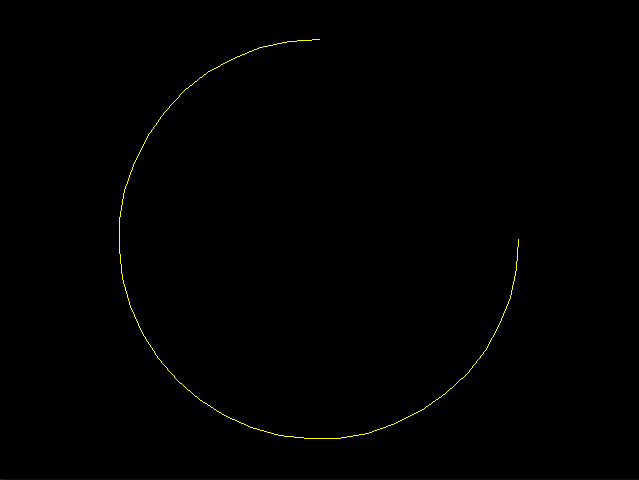

# olcPGEX_Arc

An extension to the [olcPixelGameEngine](https://github.com/OneLoneCoder/olcPixelGameEngine) created by [Javidx9](https://github.com/OneLoneCoder) which provides additional drawing routines for rendering circular arcs of variable dimension, colour and resolution.

---

## Usage

To use this extension add the `olcPGEX_Arc.h` file to your project and include the header like so
```cpp
#define OLC_PGEX_ARC
#include "olcPGEX_Arc.h"
```

Draw arc outline
```cpp
olc::Arc::Draw(ScreenWidth() * .5, ScreenHeight() * .5, 200, 3.14159 * .5, 3.14159 * 1.5, olc::YELLOW);
```


Draw filled arc
```cpp
olc::Arc::Fill(ScreenWidth() * .5, ScreenHeight() * .5, 200, 3.14159 * 1.75, 3.14159 * 1.5, olc::CYAN);
```

